# OptiScam — Activity Diagram

```mermaid
flowchart TD

    %% ─── FRONT-END lane ───────────────────────────────────────────────────────
    subgraph FE["🖥️  FRONT-END"]
        direction TB
        START(["●  Start"])
        UPLOAD[/"Upload Video\nor Paste URL Link"/]
        DUR_CHECK{"Valid\nDuration?\n≤ 60 s"}
        MAX_DUR["⚠ Maximum Duration\nExceeded — 60 s limit"]
        EVAL["Evaluate the Video"]
        VERDICT["Scam or Not?"]
        REASONING["User Receives\nReasoning"]
        END_NODE(["●  End"])

        START    --> UPLOAD
        UPLOAD   --> DUR_CHECK
        DUR_CHECK -->|NO — too long| MAX_DUR
        MAX_DUR  -.->|Try again| UPLOAD
        DUR_CHECK -->|YES — valid| EVAL
        EVAL     --> VERDICT
        VERDICT  --> REASONING
        REASONING --> END_NODE
    end

    %% ─── BACK-END lane ────────────────────────────────────────────────────────
    subgraph BE["⚙️  BACK-END"]
        direction TB
        META_CHECK{"Valid Video /\nTextual Metadata?"}
        ERR["🚫 404 Error\nTry Again"]
        YT_API["YouTube / TikTok\nDownload  (yt-dlp)"]
        FRAME_SAMPLE["Frame Sampling\n+ CLAHE Enhancement"]
        OCR["Text Extraction\nRapidOCR → TrOCR fallback\n(< 80 % confidence)"]
        AUDIO["Audio Transcription\nWhisper"]
        VID_META["Video Frames +\nTitle + Description"]
        QWEN["Qwen3-VL-2B\nClassification"]

        META_CHECK -->|No| ERR
        ERR        -.->|Retry| META_CHECK
        META_CHECK -->|Yes| YT_API
        YT_API     --> FRAME_SAMPLE
        FRAME_SAMPLE --> OCR
        FRAME_SAMPLE --> AUDIO
        OCR   --> VID_META
        AUDIO --> VID_META
        VID_META --> QWEN
    end

    %% ─── Cross-lane connections ────────────────────────────────────────────────
    UPLOAD     --> META_CHECK
    QWEN       --> EVAL

    %% ─── Styles ────────────────────────────────────────────────────────────────
    classDef startEnd fill:#1a1a2e,stroke:#7c3aed,color:#fff,rx:20
    classDef action   fill:#0f172a,stroke:#6366f1,color:#e2e8f0
    classDef decision fill:#0f172a,stroke:#ec4899,color:#f9a8d4
    classDef error    fill:#1e0a0a,stroke:#ef4444,color:#fca5a5
    classDef model    fill:#0a1628,stroke:#22d3ee,color:#a5f3fc

    class START,END_NODE startEnd
    class UPLOAD,FRAME_SAMPLE,OCR,AUDIO,VID_META,YT_API,EVAL,VERDICT,REASONING action
    class DUR_CHECK,META_CHECK decision
    class ERR,MAX_DUR error
    class QWEN model
```

## Flow Summary

| Step | Lane | Description |
|------|------|-------------|
| 1 | Front-End | User uploads a video file **or** pastes a YouTube / TikTok URL |
| 2 | Back-End | Validate: is the video/metadata reachable and parseable? |
| 2a | Back-End | **No** → 404 error, user retries |
| 2b | Back-End | **Yes** → download via yt-dlp (links) or accept uploaded file |
| 3 | Front-End | Duration check — reject videos longer than 60 seconds |
| 4 | Back-End | Frame sampling with sharpness filter + CLAHE enhancement |
| 5 | Back-End | Text extraction: RapidOCR first; TrOCR for detections < 80 % confident |
| 6 | Back-End | Audio transcription with Whisper |
| 7 | Back-End | All inputs merged → Qwen3-VL-2B classification |
| 8 | Front-End | Display **Scam / Not Scam** verdict + 4–5 sentence reasoning |
