# OptiScam — High-Level System Architecture

```mermaid
graph TD

    %% ── User ───────────────────────────────────────────────────────────────────
    USER(["👤 User\n(Browser)"])

    %% ── Frontend ────────────────────────────────────────────────────────────────
    subgraph FE["🖥️  Frontend  —  Next.js  :3000"]
        direction TB
        UI_TABS["Upload File tab\n— or —\nYouTube / TikTok Link tab"]
        UI_THUMB["Thumbnail Preview\n(HTML5 canvas / ytimg CDN)"]
        UI_POLL["Job Poller\n(GET /api/job/{id} every 3 s)"]
        UI_RESULT["Results View\nVerdict · Confidence meter\nAudio transcript · OCR timeline"]
    end

    %% ── Proxy ───────────────────────────────────────────────────────────────────
    PROXY[/"Next.js Rewrite\n/api/* → :8000/*\n(no CORS in browser)"/]

    %% ── Backend ─────────────────────────────────────────────────────────────────
    subgraph BE["⚙️  Backend  —  FastAPI  :8000"]
        direction TB
        EP_UPLOAD["POST /analyze\n(multipart video upload)"]
        EP_YT["POST /analyze-youtube\n(URL string)"]
        EP_JOB["GET /job/{job_id}\n(status polling)"]
        EP_HEALTH["GET /health"]
        JOBSTORE[("In-Memory\nJob Store\n{id → status/result}")]
        YTDLP["yt-dlp\nDownloader\n(YouTube & TikTok)"]
        BGTHREAD["Background Thread\n(daemon, non-blocking)"]
    end

    %% ── ML Pipeline ─────────────────────────────────────────────────────────────
    subgraph ML["🔬  ML Pipeline  —  OptiScamAnalyzer  (main.py)"]
        direction TB
        IMGP["ImageProcessing\n① Sharpness filter (Laplacian variance)\n② CLAHE contrast enhancement\n③ Frame sampling (≤ 6 frames)"]
        TEXTE["TextExtractor\nRapidOCR  (primary, CPU/ONNX)\nTrOCR fallback  (confidence < 80%)"]
        AUDIO["AudioTranscriber\nWhisper  (tiny → large)\nLanguage auto-detect"]
        QWEN["Qwen3VLModel\nQwen3-VL-2B-Instruct\nNF4 quantized  (BitsAndBytesConfig)\nScam definition: YouTube & TikTok policies\nLogit-based confidence  (Yes/No softmax)"]
    end

    %% ── External ─────────────────────────────────────────────────────────────────
    subgraph EXT["☁️  External Services"]
        direction LR
        YTPLATFORM["YouTube / TikTok\nplatforms"]
        HF["HuggingFace Hub\nQwen3-VL-2B-Instruct\nTrOCR weights\nWhisper weights"]
    end

    %% ── File System ──────────────────────────────────────────────────────────────
    subgraph FS["💾  File System"]
        direction LR
        UPLOADS["uploads/\n{job_id}.mp4  (temp, deleted after)"]
        OUTPUT["output_{name}_{ts}/\n├── frames/  (CLAHE JPEGs)\n├── analysis_report.json\n│     is_scam · verdict\n│     confidence_score\n│     text_timeline\n│     audio_transcription\n└── summary.txt"]
    end

    %% ── Connections ──────────────────────────────────────────────────────────────

    USER        -->|"upload video\nor paste URL"| UI_TABS
    UI_TABS     --> UI_THUMB
    UI_TABS     -->|"submit"| PROXY
    PROXY       --> EP_UPLOAD
    PROXY       --> EP_YT
    UI_POLL     -->|"GET /api/job/{id}"| PROXY
    PROXY       --> EP_JOB
    EP_JOB      -->|"status + result"| UI_POLL
    UI_POLL     --> UI_RESULT
    UI_RESULT   --> USER

    EP_UPLOAD   --> JOBSTORE
    EP_UPLOAD   --> BGTHREAD
    EP_YT       --> JOBSTORE
    EP_YT       --> YTDLP
    YTDLP       -->|"download stream"| YTPLATFORM
    YTDLP       -->|"title + description\nthumbnail_url"| JOBSTORE
    YTDLP       --> UPLOADS
    EP_UPLOAD   --> UPLOADS
    BGTHREAD    --> IMGP
    UPLOADS     --> IMGP

    IMGP        --> TEXTE
    IMGP        --> AUDIO
    IMGP        -->|"frame paths"| QWEN
    TEXTE       -->|"OCR text"| OUTPUT
    AUDIO       -->|"transcription"| OUTPUT
    QWEN        -->|"verdict_text\nconfidence_pct"| JOBSTORE
    JOBSTORE    --> EP_JOB
    QWEN        --> OUTPUT

    HF          -.->|"weights\n(first run)"| QWEN
    HF          -.->|"weights\n(first run)"| TEXTE
    HF          -.->|"weights\n(first run)"| AUDIO

    %% ── Styles ──────────────────────────────────────────────────────────────────
    classDef fe      fill:#1a0a2e,stroke:#7c3aed,color:#e2d9f3
    classDef be      fill:#0a1a2e,stroke:#2563eb,color:#d0e4f7
    classDef ml      fill:#0a2e1a,stroke:#059669,color:#d0f7e4
    classDef fs      fill:#1a1a0a,stroke:#d97706,color:#f7f0d0
    classDef ext     fill:#1a0a0a,stroke:#dc2626,color:#f7d0d0
    classDef user    fill:#2e2e2e,stroke:#9ca3af,color:#ffffff
    classDef proxy   fill:#1a1a2e,stroke:#6366f1,color:#e0e0ff

    class UI_TABS,UI_THUMB,UI_POLL,UI_RESULT fe
    class EP_UPLOAD,EP_YT,EP_JOB,EP_HEALTH,JOBSTORE,YTDLP,BGTHREAD be
    class IMGP,TEXTE,AUDIO,QWEN ml
    class UPLOADS,OUTPUT fs
    class YTPLATFORM,HF ext
    class USER user
    class PROXY proxy
```

---

## Component Summary

| Layer | Technology | Responsibility |
|-------|-----------|----------------|
| **Frontend** | Next.js 14 (React, TypeScript) | Upload/link input, thumbnail preview, job polling, results display (verdict, confidence meter, OCR, transcript) |
| **Proxy** | Next.js `rewrites` in `next.config.ts` | Forwards `/api/*` → `localhost:8000` — eliminates browser CORS |
| **Backend API** | FastAPI + Uvicorn `:8000` | Accepts uploads & URLs, spawns background threads, tracks job state, serves results |
| **Downloader** | yt-dlp | Downloads YouTube / TikTok video; extracts title, description, thumbnail |
| **Image Processing** | OpenCV + CLAHE | Sharpness filtering (Laplacian variance), contrast enhancement, frame sampling |
| **Text Extraction** | RapidOCR (primary) + TrOCR (fallback < 80% confidence) | On-screen text detection from CLAHE frames |
| **Audio Transcription** | OpenAI Whisper | Speech-to-text with language detection and timestamp segmentation |
| **Vision-Language Model** | Qwen3-VL-2B-Instruct (NF4 quantized) | Multi-modal scam classification using platform policy definition; logit-based confidence scoring |
| **File System** | Local disk | Temp video storage (`uploads/`), CLAHE frames, JSON report, text summary |
| **External** | HuggingFace Hub | Model weights fetched on first run (Qwen3-VL, TrOCR, Whisper) |

---

## Key Design Decisions

| Decision | Reason |
|----------|--------|
| Background threads + job polling | Qwen3-VL inference is GPU-bound and takes 1–3 min; async HTTP responses would time out |
| Next.js proxy rewrites | Single-origin requests — no CORS preflight required |
| Logit-based confidence | Softmax over Yes/No token logits at position 0 gives a calibrated probability; more accurate than self-reported percentages |
| NF4 quantization | Reduces Qwen3-VL-2B VRAM from ~8 GB to ~2.5 GB; fits on consumer GPUs |
| TrOCR fallback threshold 80% | RapidOCR is fast but imprecise on stylised/low-contrast text; TrOCR recovers those cases |
| yt-dlp over Selenium | No browser driver needed; handles format selection, merging, and metadata extraction natively |
