# OptiScam — System Architecture (Current)

```mermaid
graph TD
    USER(["👤 User"])

    UI["Presentation Layer\nNext.js Web Interface\nVercel Edge CDN"]

    API["Application Layer\nFastAPI REST API\nJob Management · yt-dlp"]

    subgraph ML["Intelligence Layer  —  ML Pipeline"]
        direction LR
        V["① Visual\nProcessing\nCLAHE · Sampling"]
        T["② Text\nExtraction\nRapidOCR · TrOCR"]
        A["③ Audio\nTranscription\nWhisper"]
        Q["④ Multimodal\nInference\nQwen3-VL-2B"]
        V --> T
        V --> A
        T --> Q
        A --> Q
        V --> Q
    end

    OUT[["Scam Verdict · Confidence Score · Reasoning"]]

    SRC(["YouTube · TikTok\nLocal Video File"])

    USER  -->|"Upload video / Paste URL"| UI
    UI    -->|"HTTP POST — submit"| API
    UI    -->|"HTTP GET — poll every 3 s"| API
    SRC   -->|"raw video"| API
    API   -->|"frames + metadata"| ML
    ML    -->|"verdict + confidence"| OUT
    OUT   -->|"result"| API
    API   -->|"JSON result"| UI
    UI    -->|"Verdict · Confidence · Reasoning"| USER

    classDef ui    fill:#1a0f2e,stroke:#7c3aed,color:#e9d5ff
    classDef api   fill:#0a1628,stroke:#2563eb,color:#bfdbfe
    classDef ml    fill:#0a1f0a,stroke:#059669,color:#a7f3d0
    classDef out   fill:#1a1a0a,stroke:#d97706,color:#fde68a
    classDef src   fill:#1a1a1a,stroke:#6b7280,color:#d1d5db
    classDef user  fill:#1e1e2e,stroke:#9ca3af,color:#f1f5f9

    class UI ui
    class API api
    class V,T,A,Q ml
    class OUT out
    class SRC src
    class USER user
```

| Layer | Technology | Responsibility |
|---|---|---|
| Presentation | Next.js | User interface — upload, status polling, results display |
| Application | FastAPI | REST API, job lifecycle, video download via yt-dlp |
| Intelligence | Python ML pipeline | Four-stage video analysis: visual → text → audio → multimodal inference |
| Inference model | Qwen3-VL-2B (NF4) | Scam classification grounded in YouTube & TikTok content policies; logit-derived confidence score |
