# OptiScam — Future System Architecture (Google Cloud + Vercel)

```mermaid
graph TD
    USER(["👤 User\n(Global)"])

    UI["Presentation Layer\nVercel — Next.js\nGlobal Edge CDN"]

    API["Orchestration Layer\nCloud Run  ·  CPU\nFastAPI  ·  Auto-scale 0 → N"]

    QUEUE["Messaging Layer\nCloud Pub/Sub\nAsync Job Queue"]

    subgraph GPU["Inference Layer  —  Cloud Run  ·  GPU  (NVIDIA T4 / L4)"]
        direction LR
        V["① Visual\nProcessing\nCLAHE · Sampling"]
        T["② Text\nExtraction\nRapidOCR · TrOCR"]
        A["③ Audio\nTranscription\nWhisper"]
        Q["④ Multimodal\nInference\nQwen3-VL-2B"]
        V --> T
        V --> A
        T --> Q
        A --> Q
        V --> Q
    end

    PERSIST["Persistence Layer\nFirestore  —  job state · results\nCloud Storage  —  videos · model weights"]

    SRC(["YouTube · TikTok\nLocal Video File"])

    USER   -->|"HTTPS"| UI
    UI     -->|"submit job"| API
    UI     -->|"poll result every 3 s"| API
    SRC    -->|"raw video"| API
    API    -->|"store video + create job"| PERSIST
    API    -->|"enqueue job"| QUEUE
    QUEUE  -->|"push trigger"| GPU
    GPU    -->|"verdict + confidence_score"| PERSIST
    PERSIST-->|"job result"| API
    API    -->|"JSON result"| UI
    UI     -->|"Verdict · Confidence · Reasoning"| USER

    classDef ui      fill:#0a0a0a,stroke:#ffffff,color:#ffffff
    classDef api     fill:#0a1628,stroke:#1a73e8,color:#bfdbfe
    classDef queue   fill:#0a1a28,stroke:#0ea5e9,color:#bae6fd
    classDef gpu     fill:#0a1f0a,stroke:#059669,color:#a7f3d0
    classDef persist fill:#1a1a0a,stroke:#d97706,color:#fde68a
    classDef src     fill:#1a1a1a,stroke:#6b7280,color:#d1d5db
    classDef user    fill:#1e1e2e,stroke:#9ca3af,color:#f1f5f9

    class UI ui
    class API api
    class QUEUE queue
    class V,T,A,Q gpu
    class PERSIST persist
    class SRC src
    class USER user
```

| Layer | Google Cloud Service | Role |
|---|---|---|
| Presentation | Vercel + Next.js | Global edge delivery; zero-config deployment |
| Orchestration | Cloud Run (CPU) | Stateless REST API; auto-scales to zero when idle |
| Messaging | Cloud Pub/Sub | Decouples API from GPU inference; guarantees job delivery |
| Inference | Cloud Run (GPU — T4/L4) | On-demand ML pipeline; NF4 quantisation keeps VRAM ≤ 4 GB |
| Persistence | Firestore + Cloud Storage | Job state (7-day TTL) · video uploads · analysis reports · model weight cache |
