# OptiScam — Future High-Level System Architecture (Google Cloud)

```mermaid
graph TD

    %% ── Users ────────────────────────────────────────────────────────────────────
    USER(["👤 Users\n(Global)"])

    %% ── Frontend CDN (Vercel) ────────────────────────────────────────────────────
    subgraph VERCEL["▲  Vercel  (Frontend + Edge CDN)"]
        NEXT["Next.js App\nUpload · Link tabs\nThumbnail preview\nVerdict + Confidence meter"]
        VERCEL_EDGE["Vercel Edge Network\nGlobal CDN · SSL · DDoS\nInstant cache invalidation"]
    end

    %% ── Backend Ingress ──────────────────────────────────────────────────────────
    subgraph INGRESS["🌐  Cloud Load Balancer  (Backend only)"]
        CDN["Global Anycast\nSSL Termination\nBackend routing"]
    end

    %% ── Backend API ──────────────────────────────────────────────────────────────
    subgraph API_LAYER["⚙️  Cloud Run  —  Backend API  (auto-scale 0 → N, CPU-only)"]
        FASTAPI["FastAPI Container\nPOST /analyze\nPOST /analyze-youtube\nGET /job/{id}\nGET /health"]
        YTDLP_CR["yt-dlp\n(YouTube & TikTok download)"]
    end

    %% ── Job Queue ────────────────────────────────────────────────────────────────
    subgraph PUBSUB["📨  Cloud Pub/Sub  (Async Job Queue)"]
        TOPIC["analysis-jobs\ntopic"]
        SUB["analysis-worker\nsubscription\n(push → GPU worker)"]
    end

    %% ── ML Worker ────────────────────────────────────────────────────────────────
    subgraph WORKER["🔬  Cloud Run  —  GPU Worker  (NVIDIA T4 / L4)"]
        direction TB
        IMGP_W["ImageProcessing\nSharpness filter + CLAHE\nFrame sampling ≤ 6"]
        TEXTE_W["TextExtractor\nRapidOCR → TrOCR < 80%"]
        AUDIO_W["AudioTranscriber\nWhisper"]
        QWEN_W["Qwen3VLModel\nQwen3-VL-2B-Instruct  NF4\nYouTube + TikTok policy definition\nLogit-based confidence score"]
        IMGP_W --> TEXTE_W
        IMGP_W --> AUDIO_W
        IMGP_W --> QWEN_W
        TEXTE_W --> QWEN_W
        AUDIO_W --> QWEN_W
    end

    %% ── Job State ────────────────────────────────────────────────────────────────
    subgraph FIRESTORE["🗃️  Firestore  (Job State — replaces in-memory dict)"]
        JOBDOC["{job_id}\n  status: pending|downloading\n         running|done|error\n  result: { is_scam, verdict,\n           confidence_score,\n           text_timeline,\n           audio_transcription }\n  thumbnail_url\n  created_at  (TTL 7 days)"]
    end

    %% ── Cloud Storage ────────────────────────────────────────────────────────────
    subgraph GCS["💾  Cloud Storage  (GCS)"]
        direction TB
        GCS_IN["gs://optiscam-uploads/\n(temp video — 24 h lifecycle rule)"]
        GCS_OUT["gs://optiscam-results/\nanalysis_report.json\nsummary.txt\nframes/ (CLAHE JPEGs)"]
        GCS_MODELS["gs://optiscam-models/\nModel weight cache\n(Qwen3-VL · TrOCR · Whisper)\n(avoids re-download from HuggingFace)"]
    end

    %% ── Secrets ──────────────────────────────────────────────────────────────────
    SM["🔑  Secret Manager\nAPI keys · Service account creds"]

    %% ── Observability ────────────────────────────────────────────────────────────
    subgraph OBS["📊  Observability"]
        direction LR
        MONITOR["Cloud Monitoring\n(latency · GPU util\nscam detection rate)"]
        LOGGING["Cloud Logging\n(structured JSON logs)"]
        ERRORS["Error Reporting\n(stack traces)"]
    end

    %% ── CI/CD ────────────────────────────────────────────────────────────────────
    subgraph CICD["🔧  CI/CD"]
        direction LR
        CLOUDBUILD["Cloud Build\n(git push → build → test → deploy)"]
        REGISTRY["Artifact Registry\nDocker images\n(api · gpu-worker · frontend)"]
    end

    %% ── External ─────────────────────────────────────────────────────────────────
    subgraph EXT["☁️  External"]
        direction LR
        YTPLATFORM["YouTube / TikTok\nplatforms"]
        HF["HuggingFace Hub\n(first deploy only)"]
    end

    %% ── Connections ──────────────────────────────────────────────────────────────

    USER          -->|"HTTPS"| VERCEL_EDGE
    VERCEL_EDGE   --> NEXT
    USER          -->|"HTTPS /api/*"| CDN
    CDN           -->|"/api/*"| FASTAPI

    NEXT          -- "POST /api/analyze\nPOST /api/analyze-youtube\nGET /api/job/{id}" --> CDN

    FASTAPI       -- "create job doc\n(status: pending)" --> JOBDOC
    FASTAPI       -- "upload video\nto temp bucket" --> GCS_IN
    FASTAPI       -- "publish job message" --> TOPIC
    FASTAPI       -- "read job doc\n(poll response)" --> JOBDOC
    YTDLP_CR      -- "stream download" --> YTPLATFORM
    YTDLP_CR      -- "write video +\nthumbnail_url → Firestore" --> GCS_IN

    TOPIC         --> SUB
    SUB           -->|"HTTP push"| IMGP_W

    IMGP_W        -- "read video" --> GCS_IN
    QWEN_W        -- "write report\n+ frames" --> GCS_OUT
    QWEN_W        -- "update job doc\n(status: done\nresult + confidence_score)" --> JOBDOC

    GCS_MODELS    -.->|"cached weights\n(fast cold start)"| QWEN_W
    GCS_MODELS    -.->|"cached weights"| TEXTE_W
    GCS_MODELS    -.->|"cached weights"| AUDIO_W
    HF            -.->|"weights\n(first deploy only)"| GCS_MODELS

    FASTAPI       --> LOGGING
    QWEN_W        --> LOGGING
    FASTAPI       --> ERRORS
    QWEN_W        --> ERRORS
    MONITOR       -.- LOGGING

    SM            -.->|"inject secrets"| FASTAPI
    SM            -.->|"inject secrets"| WORKER

    CLOUDBUILD    --> REGISTRY
    REGISTRY      -.->|"deploy"| FASTAPI
    REGISTRY      -.->|"deploy"| WORKER

    %% ── Styles ───────────────────────────────────────────────────────────────────
    classDef vercel   fill:#0a0a0a,stroke:#ffffff,color:#ffffff
    classDef gfe      fill:#1a0a2e,stroke:#7c3aed,color:#e2d9f3
    classDef gbe      fill:#0a1a2e,stroke:#1a73e8,color:#d0e4f7
    classDef gml      fill:#0a2e1a,stroke:#34a853,color:#d0f7e4
    classDef gfs      fill:#2e1a0a,stroke:#fbbc04,color:#f7f0d0
    classDef gfire    fill:#2e0a0a,stroke:#ea4335,color:#f7d0d0
    classDef gext     fill:#1a1a1a,stroke:#9aa0a6,color:#e8eaed
    classDef gobs     fill:#0a1a2e,stroke:#4285f4,color:#d0e4f7
    classDef gcicd    fill:#1a1a0a,stroke:#fbbc04,color:#f7f0d0
    classDef gsm      fill:#2e1a2e,stroke:#a142f4,color:#e8d5f7
    classDef user     fill:#2e2e2e,stroke:#9ca3af,color:#ffffff
    classDef ingress  fill:#0a2e2e,stroke:#00bcd4,color:#d0f7f7

    class NEXT,VERCEL_EDGE vercel
    class FASTAPI,YTDLP_CR gbe
    class IMGP_W,TEXTE_W,AUDIO_W,QWEN_W gml
    class GCS_IN,GCS_OUT,GCS_MODELS gfs
    class JOBDOC gfire
    class YTPLATFORM,HF gext
    class MONITOR,LOGGING,ERRORS gobs
    class CLOUDBUILD,REGISTRY gcicd
    class SM gsm
    class USER user
    class CDN ingress
```



---

## Google Cloud Services Mapping

| Current (Local) | Future (Google Cloud) | Reason |
|---|---|---|
| `Next.js dev server :3000` | **Vercel** (Next.js native platform, global edge CDN) | Zero-config Next.js deploy; own CDN handles frontend; no GCP cost for static assets |
| `Uvicorn :8000` (single process) | **Cloud Run** (CPU, auto-scale 0→N) | Scale to zero, pay-per-request |
| Background `threading.Thread` | **Cloud Pub/Sub** → **Cloud Run GPU** (push subscription) | Decouples API from heavy inference; GPU worker scales independently |
| In-memory `jobs: dict` | **Firestore** (NoSQL, TTL 7 days) | Survives restarts; accessible across multiple API instances |
| `uploads/` local dir | **Cloud Storage** `optiscam-uploads/` (24 h lifecycle) | Shared between API and GPU worker containers |
| `output_*/` local dir | **Cloud Storage** `optiscam-results/` | Durable, downloadable by frontend if needed |
| HuggingFace download on every cold start | **Cloud Storage** `optiscam-models/` (weight cache) | Cold start from GCS bucket is much faster than HuggingFace |
| Hardcoded secrets / `.env.local` | **Secret Manager** | Secure, auditable, rotatable |
| Manual deployment | **Cloud Build** + **Artifact Registry** | Git push → automated build → deploy |
| `print()` statements | **Cloud Logging** + **Cloud Monitoring** + **Error Reporting** | Structured observability, alerting on error rate |

---

## Deployment Topology

```
  User
   │
   ├──HTTPS──▶  Vercel Edge CDN ──▶ Next.js App  (frontend — NOT on GCP)
   │                │
   │         (API calls: POST /api/analyze, GET /api/job/{id})
   │                │
   └──HTTPS──▶  GCP Cloud Load Balancer
                        │
                   Cloud Run (CPU)
                   FastAPI :8080 ──▶ Pub/Sub ──▶ Cloud Run (GPU T4/L4)
                        │              topic        OptiScamAnalyzer
                        │                               │
                    Firestore ◀─────────────────────────┘
                    (job state)
                        │
                 Cloud Storage (GCS)
             (uploads · results · models)
```

---

## Key Cloud Architecture Decisions

| Decision | Detail |
|---|---|
| **Separate CPU API + GPU Worker** | FastAPI handles HTTP (no GPU needed); GPU worker only spins up when there are jobs — avoids paying for idle GPU time |
| **Pub/Sub push subscription** | GPU Cloud Run receives jobs via HTTP push; no long-polling worker needed |
| **Firestore over Cloud SQL** | Job documents are semi-structured JSON; Firestore native TTL cleanly expires old jobs |
| **GCS model cache** | Qwen3-VL-2B + TrOCR + Whisper weights are ~5 GB total; caching in GCS cuts cold start from ~5 min (HuggingFace) to ~30 s |
| **Vercel for frontend** | Native Next.js platform; zero-config deploys on git push; own global edge CDN; keeps frontend entirely separate from GCP billing |
| **Cloud Run GPU (T4 / L4)** | T4 gives ~15 TFLOPS FP16 for ~$0.35/hr; L4 is faster at ~$0.57/hr; NF4 quantization keeps VRAM under 4 GB |
| **24 h GCS lifecycle on uploads** | Videos are large; deleting after 24 h avoids unbounded storage cost |
