# OptiScam — Class Diagram

```mermaid
classDiagram
    direction TB

    class OptiScamAnalyzer {
        +config : dict
        +image_processor : ImageProcessing
        +text_extractor : TextExtractor
        +audio_transcriber : AudioTranscriber
        +vision_model : Qwen3VLModel
        +__init__(config)
        +process_video(video_path, title, description, output_dir, frame_interval, use_sharpness_filter) dict
        +analyze_video_holistic(video_path, title, description, output_dir) dict
        -_generate_summary(results, output_path)
    }

    class ImageProcessing {
        +clip_limit : float
        +tile_grid_size : tuple
        +sharpness_threshold : float
        -_clahe : cv2.CLAHE
        +__init__(clip_limit, tile_grid_size, sharpness_threshold)
        +calculate_sharpness(image) float
        +apply_clahe(image) ndarray
        +sample_frames_by_sharpness(video_path, interval, output_dir, use_sharpness_filter) list
        +sample_frames(video_path, interval, output_dir)
    }

    class TextExtractor {
        +use_trocr_fallback : bool
        +trocr_confidence_threshold : float
        +rapid_ocr : RapidOCR
        +trocr_processor : TrOCRProcessor
        +trocr_model : VisionEncoderDecoderModel
        +device : str
        +__init__(use_trocr_fallback, trocr_confidence_threshold)
        +extract_with_rapidocr(image_path) list
        +extract_with_trocr(image_path, bbox) str
        +extract_text(image_path) list
        +extract_text_from_frames(frame_metadata) list
        +get_text_timeline(text_detections) dict
    }

    class AudioTranscriber {
        +model_size : str
        +language : str
        +device : str
        +model : Whisper
        +__init__(model_size, device, language)
        +extract_audio_from_video(video_path, output_audio_path) str
        +transcribe_audio(audio_path, word_timestamps) dict
        +transcribe_video(video_path, extract_audio, temp_audio_path, cleanup_audio) dict
        +get_transcription_timeline(transcription_result) list
        +get_text_at_timestamp(transcription_result, timestamp) str
        +export_transcription(transcription_result, output_path, format)
        +get_full_text(transcription_result) str
    }

    class Qwen3VLModel {
        +model_name : str
        +device : str
        +model : AutoImageTextToText
        +processor : AutoProcessor
        +__init__(model_name, device)
        +classify_video(image_paths, title, description, max_frames, max_new_tokens) str
        +analyze_image(image_path, prompt, max_new_tokens) str
        +analyze_frames_for_scams(frame_metadata, custom_prompt) list
        +analyze_video_holistic(video_path, title, description, transcription, ocr_text, max_new_tokens) str
        +analyze_with_context(image_path, context_info, prompt_template) str
        +batch_analyze(image_paths, prompt, batch_size) list
    }

    class PreProcessing {
        <<utility>>
        +denoise_image(image, method)$ ndarray
        +adjust_brightness_contrast(image, brightness, contrast)$ ndarray
        +unsharp_mask(image, kernel_size, sigma, amount, threshold)$ ndarray
        +auto_white_balance(image)$ ndarray
        +enhance_for_ocr(image)$ ndarray
        +detect_and_correct_skew(image)$ ndarray
        +resize_for_model(image, target_size, maintain_aspect)$ ndarray
        +apply_preprocessing_pipeline(image, for_ocr, for_model)$ ndarray
    }

    OptiScamAnalyzer "1" *-- "1" ImageProcessing : owns
    OptiScamAnalyzer "1" *-- "1" TextExtractor : owns
    OptiScamAnalyzer "1" *-- "1" AudioTranscriber : owns
    OptiScamAnalyzer "1" *-- "1" Qwen3VLModel : owns
    OptiScamAnalyzer ..> PreProcessing : optional use

    note for OptiScamAnalyzer "Entry point via main()\nTwo modes: process_video() and analyze_video_holistic()"
    note for Qwen3VLModel "Loaded with NF4 quantization via BitsAndBytesConfig\nDefault model: Qwen/Qwen3-VL-2B-Instruct"
    note for TextExtractor "RapidOCR primary (CPU/ONNX)\nTrOCR fallback on low confidence (GPU)"
```



## Data flow

```
video_path
    │
    ├──▶ ImageProcessing.sample_frames_by_sharpness()
    │         └── List[frame_metadata]  ──────────────────────────┐
    │                                                              │
    ├──▶ TextExtractor.extract_text_from_frames(frame_metadata)   │
    │         └── List[text_detections]                           │
    │              └── .get_text_timeline()  ──────────────────┐  │
    │                                                           │  │
    ├──▶ AudioTranscriber.transcribe_video()                    │  │
    │         └── transcription dict  ─────────────────────┐   │  │
    │                                                       │   │  │
    └──▶ Qwen3VLModel.analyze_with_context(                 │   │  │
                  image_path  ◀──────────────────────────────│──│──┘
                  context {                                  │  │
                    transcription  ◀─────────────────────────┘  │
                    ocr_text  ◀─────────────────────────────────┘
                  }
              )
              └── analysis string

All results ──▶ JSON report + summary.txt
```
