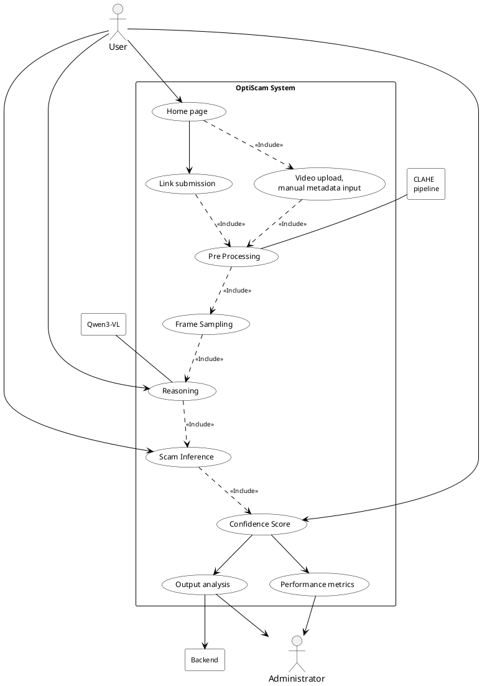

# OptiScam — Use Case Diagram

---

> **Render this diagram:**
> - **VS Code** → install *PlantUML* extension → right-click → *Preview Current Diagram*
> - **Online** → paste the `@startuml … @enduml` block at [plantuml.com/plantuml](https://www.plantuml.com/plantuml/uml/)

---

## Use Case Table

| # | Use Case | Actor(s) | Description |
|---|---|---|---|
| 1 | Home page | User | Entry point — choose upload or link submission |
| 2 | Video upload, manual metadata input | User | Upload a local video file + optional title & description |
| 3 | Link submission | User | Paste a YouTube or TikTok URL |
| 4 | Pre Processing | System, CLAHE pipeline | Frame extraction with sharpness filtering + CLAHE contrast enhancement |
| 5 | Frame Sampling | System | Evenly subsample up to 6 representative frames |
| 6 | Reasoning | User, System, Qwen3-VL | Multi-modal inference — frames + title + description → model output |
| 7 | Scam Inference | User, System | Parse model output → Yes / No verdict |
| 8 | Confidence Score | User, System | Derive confidence from model reasoning |
| 9 | Output analysis | System, Backend, Administrator | Persist results (JSON report, summary.txt) |
| 10 | Performance metrics | System, Administrator | Log frame count, OCR detections, audio segments, language |

## Relationships

| Relationship | Type | Notes |
|---|---|---|
| Home page → Video upload | `<<Include>>` | Always available from home |
| Home page → Link submission | association | Alternative input path |
| Video upload / Link → Pre Processing | `<<Include>>` | Both paths merge here |
| Pre Processing ↔ CLAHE pipeline | association | CLAHE is an external processing component |
| Pre Processing → Frame Sampling | `<<Include>>` | |
| Frame Sampling → Reasoning | `<<Include>>` | |
| Reasoning ↔ Qwen3-VL | association | External model actor |
| Reasoning → Scam Inference | `<<Include>>` | |
| Scam Inference → Confidence Score | `<<Include>>` | |
| Confidence Score → Output analysis | association | |
| Confidence Score → Performance metrics | association | |
| Output analysis → Backend / Administrator | association | Results stored and reviewed |
| Performance metrics → Administrator | association | Monitoring |
