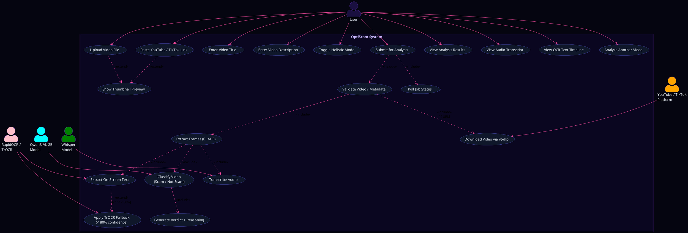

# OptiScam — Use Case Diagram

---

> **Tip — render this diagram:**
> - **VS Code**: install the *PlantUML* extension → right-click → *Preview Current Diagram*
> - **Online**: paste the `@startuml … @enduml` block at [plantuml.com/plantuml](https://www.plantuml.com/plantuml/uml/)

---

## Use Case Descriptions

### Primary Actor — User

| Use Case | Description |
|---|---|
| Upload Video File | Drag-and-drop or browse for a local MP4 / MOV / AVI / MKV / WebM file |
| Paste YouTube / TikTok Link | Enter a public URL; yt-dlp fetches the video, title, and description automatically |
| Enter Video Title | Optional free-text — passed directly into the model prompt to improve accuracy |
| Enter Video Description | Optional free-text — same purpose as title |
| Toggle Holistic Mode | Switches to a lower frame rate suitable for longer videos |
| Submit for Analysis | Triggers the full backend pipeline |
| View Analysis Results | Sees the Scam / Not Scam verdict plus 4–5 sentence AI reasoning |
| View Audio Transcript | Expands the collapsible Whisper transcript panel |
| View OCR Text Timeline | Expands the collapsible per-frame text detection panel |
| Analyze Another Video | Resets the UI to start a new job |

### Secondary Actors — AI Models / Platform

| Actor | Role |
|---|---|
| YouTube / TikTok Platform | Source of video, title, description, and thumbnail via yt-dlp |
| Qwen3-VL-2B Model | Multi-modal vision-language model — produces the final verdict |
| Whisper Model | OpenAI speech-to-text — transcribes the video audio track |
| RapidOCR / TrOCR | Detects on-screen text in frames; TrOCR activates when RapidOCR confidence < 80 % |

### Include / Extend relationships

| Relationship | Type | Condition |
|---|---|---|
| Submit → Validate Video | `<<include>>` | Always |
| Validate → Download via yt-dlp | `<<include>>` | Only when a URL was pasted |
| Validate → Extract Frames | `<<include>>` | Always |
| Extract Frames → Transcribe Audio | `<<include>>` | Always |
| Extract Frames → Extract Text | `<<include>>` | Always |
| Extract Text → TrOCR Fallback | `<<extend>>` | Only when RapidOCR confidence < 80 % |
| Extract Frames → Classify Video | `<<include>>` | Always |
| Classify Video → Generate Verdict | `<<include>>` | Always |
| Submit → Poll Job Status | `<<include>>` | Always (every 3 s until done) |
| Paste Link → Show Thumbnail | `<<extend>>` | When a valid YouTube URL is detected |
| Upload File → Show Thumbnail | `<<extend>>` | First frame captured via HTML5 video API |
